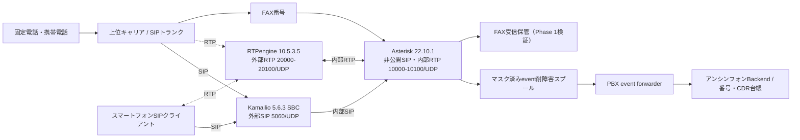

# anshin-phone-infra

アンシンフォンのSIP/PBX基盤です。

Phase 1の最初の合格点は、上位キャリアから払い出された実番号をこの基盤へ収容し、スマートフォンのSIPクライアントで外線の着信・通話・発信ができることです。FAX番号は同じ番号台帳へ収容し、専用DIDをFAX受信経路へ振り分けます。

## Phase 1の通信経路



このリポジトリのPhase 1構成にはKamailio SBC、RTPengine及び非公開Asteriskが含まれ、隔離Docker環境で模擬キャリアとの接続を検証します。商用提供前に追加する対象は、SIP TLS/SRTP、レート制限・不正発信対策、冗長化、モバイルPush着信、監視及び課金です。Ubuntu 24.04のVPSへFreePBX 17を直接導入せず、Asterisk 22.10.1をDebian 12コンテナで固定します。

## 構成

- `compose.phase1.yaml`: Kamailio、RTPengine、Asterisk、Backend、PostgreSQL及びPBX event forwarderのPhase 1構成
- `compose.phase1.mock.yaml`: 実番号・実認証情報を使わない隔離SIP E2E構成
- `deploy/asterisk`: Asterisk 22 LTSのビルド、実番号用PJSIP設定、着信・発信ダイヤルプラン
- `scripts/verify_phase1.sh`: secretを読み込まずに構成、REGISTER認証・固定IP認証、event連携及び高リスク宛先の遮断を検査
- `scripts/phase1_status.sh`: secret値やevent本文を表示せず、service、SIP、Backend及びspool状態を点検
- `docs/runbooks/telephony-platform/phase1_real_number_runbook.md`: キャリア情報の受領から実通話試験までの手順

Backendは別リポジトリです。ローカルとVPSのどちらも、次の配置を前提とします。

```text
anshin-phone-infra/
├── compose.phase1.yaml
└── anshin-phone-backend/   # separate git clone; infra側ではgitignore
```

## Secret管理

`.env`、`.env.*`、secret実体は作成・コミットしません。起動時はGit管理外の専用ディレクトリを用意し、Docker Composeへ絶対パスを渡します。

必要なsecretファイル:

| ファイル | 内容 |
| --- | --- |
| `postgres_password` | PostgreSQL専用パスワード |
| `carrier_sip_password` | 上位キャリアのSIP認証パスワード。IP認証の場合も空ファイルにはせず、起動方式確定後に扱う |
| `smartphone_sip_password` | Phase 1検証端末専用の十分に長いランダム値 |
| `internal_api_token` | PBXと管理系だけが使うBackend内部API token |

secret以外の接続値も、起動シェルの環境変数又は運用中のsecret managerから渡します。値をリポジトリへ保存しません。

## 検証

```bash
./scripts/verify_phase1.sh
```

隔離環境で仮想キャリア、スマートフォンREGISTER、着信、発信、CDR及びFAX eventのBackend登録まで確認する場合は次を実行する。

```bash
RUN_PHASE1_SIP_E2E=1 ./scripts/verify_phase1.sh
```

この検査は、文書用IPアドレス、架空DID及び一時的なテスト値だけを使用する。実電話番号、キャリア認証情報、`.env`又は外部secretは読み込まない。REGISTER認証と固定IP認証の両方でAsterisk設定が完全に生成されること、TEL/FAXが別経路になること、110・118・119、国際電話、0570及び0990がPhase 1では遮断されることを確認する。

実番号試験は[Phase 1実番号接続手順](docs/runbooks/telephony-platform/phase1_real_number_runbook.md)に従います。キャリアのDID、SIP接続先、認証方式、接続元IP、コーデック、発信者番号通知、FAX方式が未確定の状態では、外線試験を完了扱いにしません。Phase 1のスマートフォンは、固定送信元IPを許可した試験用Wi-Fi又はWireGuard等のVPN経路から接続し、SIP/RTPを全世界へ無制限公開しません。
